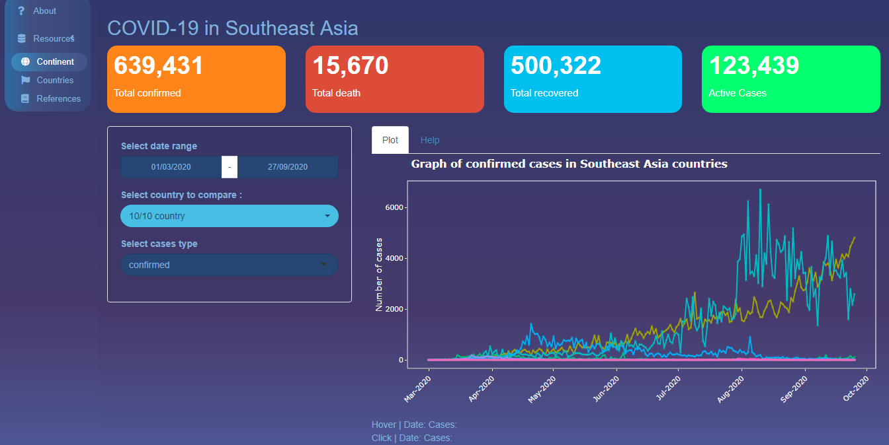
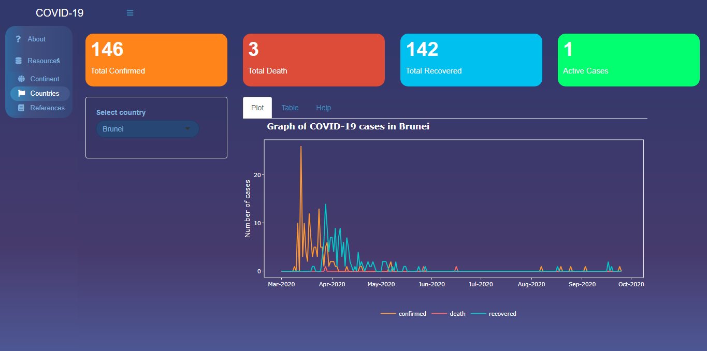

```{r, include = FALSE}
knitr::opts_chunk$set(
  collapse = TRUE,
  comment = "#>"
)
```

```{r setup}
library(southeastcovid)
```

The **southeastcovid** package extends the [coronavirus](https://ramikrispin.github.io/coronavirus/) package with shiny app. Built on top of the [shiny](https://shiny.rstudio.com/), a shiny application is an interactive dashboard made to explore the coronavirus development, specifically in South East Asia. The `southeastcovid` package aims to let users understand the coronavirus trend in South East Asia countries with the interactive app.

## Dataset

`southeast` creates a tibble object, which contain the pre-loaded dataset that used in the shiny application. It can be checked with ?southeastcovid::southeast to understand the variable included.

```{r dataset}
library(dplyr)
library(lubridate)
covid_cases <- southeastcovid::southeast %>% 
  select(date, country, type, cases)
head(covid_cases)
```


## How to launch

`launch_app()` is the function that launch the shiny application. It takes the working directory and find the `\inst\app` folder to which contain the `app.R`

```{r launch}
library(southeastcovid)
launch_app() 
```


## What app does

An application to explore the development of coronavirus in South East Asia countries. There are two graph in this application. In the continent tab, you can see the graph for daily cases in all South East Asia In the countries tab, there are graph for every representative country in South East Asia.

Both graph represented by the day, countries, type of cases, and number of each representative cases.

## How to use it

### Tab : Continent



In this tab, there is a line graph showing the progress of cases in all South East Asia countries. The x-axis shows the date, while the y-axis shows the number of cases. Each line represents one country. The features available in the sidebar are :

* Date range: date range from 01/03/2020 to 27/09/2020. When pressing this field, a calendar will appear to select the minimum and maximum date ranges as desired. The graph will adjust according to the selected date.
* Country selection: contains ten countries that can be selected multiple times. This feature can be used to compare one country to another.
* Type of cases: There are three types of cases, namely confirmed, death, and recovered. Can only select one case to visualize.
* ValueBox : shows the total of each case according to the Date Range and Country options.

At the bottom there is Hover Data and Click Data. Hover data will show the date and number of cases dynamically when the cursor hover the line graph. Meanwhile, Click Data will show the date data and the number of cases at a point when the line graph is clicked.

This section useful when you want to compare the number of one individual cases in multiple country.

### Tab : Countries



In this tab, there is a line graph showing the progress of cases in one country. On the x-axis it shows the date, while on the y-axis it shows the number of cases. Each line represents the type of case (confirmed, death, and recovered). The features available on the sidebar are:

* Country selection: contains ten countries which can only be selected once.
* Interactive Table: shows the country's daily case data. The table will change according to the country selection.
* ValueBox : shows the total of each case and active cases according to the Country selection.
This section can be used to compare the number of all cases in a country.